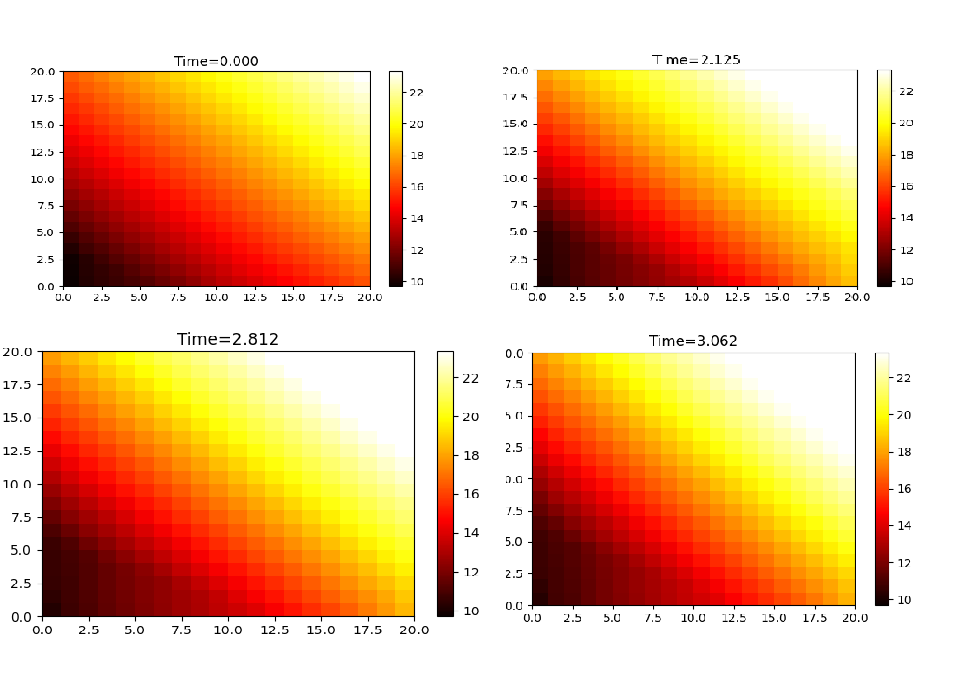

Execution Steps:

1. Ensure that Python is installed in your environment.
2. Install the required libraries by running the following command in your terminal or command prompt:

```
pip install -r requirements.txt
```

3. Copy the provided code into a Python script or Jupyter Notebook.
4. Run the script or notebook to execute the code.

The code will perform the following steps:

- Define the neural network model for neural density estimation.
- Train the model to simulate heat transfer using the heat equation and initial conditions.
- Visualize the spatial distribution of the heat density at a fixed time using contour plots and heatmaps.
- Generate an animation to show the evolution of the heat distribution over time.
- Save the trained model to a file using `torch.save()` for future use or further analysis.

Output 


Github link : https://github.com/manjirigunaji/Deep-Neural-Network
